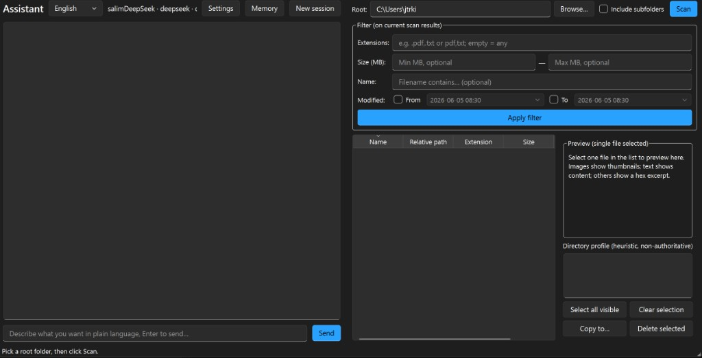

# FileManager

Desktop file utility with an optional **AI Agent** side panel: scan a root folder, filter and sort files, multi-select batches, copy or delete (Recycle Bin on fixed local drives on Windows; permanent delete on removable/network/CD volumes with a warning), directory profile (heuristic), and natural-language file operations via configured LLM.



*Fluent UI: language switch, LLM profile, scan/filter/preview on the right; natural-language tasks on the left.*

---

## English

### Overview

FileManager is a **PySide6 (Qt for Python)** app with two parallel entry points:

| Area | Role |
|------|------|
| **Left — Chat panel** | Agent: scan / filter / preview / copy / delete / remember preferences via tools + confirmation cards. |
| **Right — Classic UI** | Original file manager: root path, **Scan** button, filters, table, preview, profile, manual copy/delete. |

The two **do not share scan state**: Agent results live in session memory; the table shows only what the right panel has scanned.

### Quick start — GitHub to running

**Prerequisites:** Git, **Python 3.10+** (`python --version`), network for `pip`.

#### 1. Get the code

```bash
git clone https://github.com/JTRMinsk/filemanager.git
cd filemanager
git checkout agentization   # Agent features; use main/master if that is your default branch
```

#### 2. Virtual environment (recommended)

Windows (PowerShell):

```powershell
python -m venv .venv
.\.venv\Scripts\Activate.ps1
```

macOS / Linux:

```bash
python3 -m venv .venv
source .venv/bin/activate
```

#### 3. Install dependencies

**Right panel only** (scan / filter / copy / delete — no Agent chat):

```bash
pip install -e .
```

**With Agent** (pick one LLM backend):

```bash
pip install -e ".[openai]"      # DeepSeek / OpenAI-compatible API
# pip install -e ".[anthropic]" # Claude
```

#### 4. Launch

```bash
python -m filemanager
```

Or, if `Scripts` is on `PATH`: `filemanager`

#### 5. First-time UI workflow

| Step | Where | Action |
|------|--------|--------|
| 1 | Left — **Settings** | Add a profile (name, backend, model, API key). DeepSeek: backend `deepseek`, Base URL can stay default. Click save; pick as active. |
| 2 | Right — **Root path** | Enter or browse the folder to manage (e.g. `D:\Projects`). |
| 3 | Right — **Scan** | Click **Scan** (optionally check “Include subfolders”; default is off). Table fills up to **500** files. |
| 4 | Right | Use filters, preview (single select), **Copy to…** / **Delete selected** as needed. |
| 5 | Left — chat | Describe tasks in plain language; yellow **confirm** cards appear before writes (copy/delete/remember). |
| 6 | Left — **Memory** | Optional: view/edit long-term notes (`%APPDATA%\filemanager\memory.md`). |

Config, memory, and logs live under **`%APPDATA%\filemanager\`** on Windows (or the platform equivalent) — **not** beside the `.exe`.

#### 6. Verify (optional, no API key)

From repo root:

```bash
python tools/check_phase2.py
python tools/check_phase3.py
python tools/check_phase4.py
```

GUI smoke (offscreen):

```bash
# Windows PowerShell:
$env:QT_QPA_PLATFORM = "offscreen"; python tools/check_phase5_gui.py

# macOS / Linux:
QT_QPA_PLATFORM=offscreen python tools/check_phase5_gui.py
```

#### 7. Package for distribution (optional)

Install pack tooling **and** LLM extra if the built app should use Agent:

```bash
pip install -e ".[pack,openai]"
# or: pip install -e ".[pack,anthropic]"
```

From repo root:

```bash
python -m PyInstaller filemanager.spec --noconfirm
```

Output: **`dist/FileManager/`** — ship the **whole folder** (includes `FileManager.exe` and Qt runtime).

**End user:** zip the whole `dist/FileManager/` folder for distribution → unzip on the target PC → run `FileManager.exe` → configure API in Settings (same `%APPDATA%` config as dev runs).

---

### Scan behaviour (important)

Two independent pipelines, **each capped at 500 files** (separate constants):

| Pipeline | Constant | Where |
|----------|----------|--------|
| Right GUI `ScanThread` | `GUI_SCAN_MAX = 500` | `scanner.py` |
| Agent `scan_directory` tool | `SCAN_CAP = 500` | `tools.py` |

- **Default**: “Include subfolders” is **unchecked** on the right panel (single-level scan unless you enable recursion).
- **Agent copy/delete does not auto-rescan** the right table; use **Scan** manually if you need the table refreshed.
- When a scan hits the 500 limit, the status bar notes that more files may exist.

### Agent features

The left panel runs an **LLM tool loop** in a background thread (`AgentThread`), so the UI stays responsive. Each message you send may trigger several tool calls; the model only sees **summaries** of large file lists (full results stay in this session’s memory).

#### Session vs long-term memory

| Kind | What it stores | Survives **New session**? | On disk? |
|------|----------------|---------------------------|----------|
| **Session** | Chat history, last scan/filter file lists | **No** — cleared when you click **New session** | No (RAM only) |
| **Long-term** | Preferences, directory notes (`memory.md`) | **Yes** | `%APPDATA%\filemanager\memory.md` |

- At the start of every session, the full contents of `memory.md` are injected into the model’s system prompt (if the file exists).
- **Memory** button: open and edit the file directly (Markdown, sections like `# 用户偏好`).
- The Agent can also call **`remember`** (after you confirm) or **`recall`** (keyword search in the file). Long-term memory helps the model understand you; it **never** bypasses copy/delete confirmation.

#### Tools the Agent can call

| Tool | Purpose |
|------|---------|
| `scan_directory` | List files under a path (up to **500**); caches full list for this session |
| `filter_files` | Narrow the last scan/filter by extension, size, name, modified date |
| `preview_file` | Preview one file (image hint / text excerpt / hex) |
| `profile_directory` | Heuristic “what kind of folder is this?” on the current working set |
| `copy_files` | Copy files to a destination directory |
| `delete_files` | Delete files (Recycle Bin on fixed local drives; permanent on removable/network with warning in the preview) |
| `remember` | Append a line to long-term memory (requires confirmation) |
| `recall` | Search `memory.md` by keyword (empty query = all bullet lines) |

**Working set** for copy/delete: the latest `filter_files` result, or if none, the latest `scan_directory` result. The model can also pass explicit `paths`. After Agent copy/delete, the **right table is not refreshed** automatically — click **Scan** if you need it updated.

#### UI context

Each chat message automatically includes the **right panel’s current root path** and whether “Include subfolders” is checked, so phrases like “this folder” or “current directory” refer to that path without extra questions.

#### Confirmation & safety

- Flow: **preview** what will happen → **confirm card** in the chat panel → execute.
- Default policy (`confirm_mode=all`): **every** tool call asks for approval, including read-only tools like `scan_directory` and `recall` (most conservative).
- **Allowed roots** (Settings): if empty, Agent writes are limited to your **user home** subtree; you can add extra roots. System directories (e.g. `C:\Windows`, `Program Files`) are always blocked.
- Copy/delete actions are logged to **`memory.db`** (SQLite, same user data folder).

#### LLM configuration

- **Settings**: multiple named profiles (backend, model, API key, optional base URL). Keys are stored in **plain text** in `config.json` today (prototype).
- Backends: **`anthropic`**, **`openai`**, **`deepseek`** (OpenAI-compatible). **`ollama`** appears in the UI but is **not implemented** yet.
- **New session**: clears short-term chat and cached scans; reloads long-term memory into the next turn.
- Long conversations may be **compressed** automatically (older turns summarized) to stay within context limits.

#### Not implemented yet

- Drag-and-drop files into the chat (planned in `AGENTS.md`; `run_turn` already accepts attachments for future use).
- Ollama local backend, dry-run mode, semantic vector recall for memory.

#### User data files (Windows example)

| File | Role |
|------|------|
| `config.json` | API profiles, active profile, `allowed_roots` |
| `memory.md` | Long-term memory (human-editable) |
| `memory.db` | Operation log for Agent copy/delete |

All under **`%APPDATA%\filemanager\`** — not beside the `.exe`. Copying only the app folder to another PC does **not** migrate your memory or API settings.

**CLI (no GUI):** from repo root, `python tools/cli_chat.py` — same Agent loop; needs API key in env or profile (see script help).

Implementation details: **`AGENTS.md`**. Release notes: **`CHANGELOG.md`**.

### Design principles (classic UI)

- **UI thread stays responsive**: filesystem walks run in `QThread` (`ScanThread`).
- **Model / view separation**: `FileTableModel` + `FileFilterProxy`.
- **Safe deletes**: Windows fixed drives → Recycle Bin; removable/network/CD → permanent delete with warning.
- **Directory profile is non-authoritative**: heuristic hints only.

### Core components

| Module | Responsibility |
|--------|----------------|
| `main.py` / `window.py` | Entry; split layout (chat + classic UI). |
| `chat_panel.py` / `agent_thread.py` | Agent UI and background LLM turns. |
| `agent.py` / `tools.py` / `llm/` | Agent loop, tool registry, LLM adapters. |
| `core.py` | Pure scan / filter / preview (shared by GUI and Agent). |
| `scanner.py` | `ScanThread` for the right panel (`GUI_SCAN_MAX`). |
| `guard.py` / `oplog.py` / `memory.py` | Write guards, operation log, MD memory. |
| `models.py` / `table_model.py` / `profile.py` / `fs_ops.py` | Unchanged core file ops and table model. |

See `AGENTS.md` for full agentization architecture.

### Repository layout

```text
filemanager/
  pyproject.toml
  CHANGELOG.md
  README.md
  AGENTS.md                 # Agent implementation spec
  src/filemanager/          # application package
  tools/
    check_phase2.py …       # offline acceptance (no API key for phase 2–4)
    check_phase5_gui.py     # GUI smoke (QT_QPA_PLATFORM=offscreen)
    cli_chat.py             # CLI Agent (needs API key)
```

**Requirements:** Python ≥ 3.10, `PySide6`, `send2trash`. Install and run steps: see **Quick start** above.

---

## 中文

### 概览

FileManager 是基于 **PySide6** 的桌面工具，左侧为 **Agent 对话栏**，右侧为**原有文件管理界面**（根目录、扫描、筛选、表格、预览、画像、手动复制/删除）。两侧**扫描结果互不自动同步**。


*Fluent 风格界面：顶栏可切换中/英文与 LLM 配置；右侧扫描/筛选/预览；左侧用自然语言驱动 Agent。*

### 快速上手 — 从 GitHub 到运行

**前置条件：** 已安装 Git、**Python 3.10+**（`python --version`）、可访问网络以下载依赖。

#### 1. 获取代码

```bash
git clone https://github.com/JTRMinsk/filemanager.git
cd filemanager
git checkout agentization   # Agent 功能在此分支；若默认分支已合并可省略
```

#### 2. 虚拟环境（建议）

Windows（PowerShell）：

```powershell
python -m venv .venv
.\.venv\Scripts\Activate.ps1
```

macOS / Linux：

```bash
python3 -m venv .venv
source .venv/bin/activate
```

#### 3. 安装依赖

**仅右侧传统文件管理**（扫描 / 筛选 / 复制 / 删除，不用 Agent）：

```bash
pip install -e .
```

**需要 Agent 对话**（任选一种 LLM 后端）：

```bash
pip install -e ".[openai]"      # DeepSeek / OpenAI 兼容 API
# pip install -e ".[anthropic]" # Claude
```

#### 4. 启动

```bash
python -m filemanager
```

若已将 Python 的 `Scripts` 加入 PATH，也可直接：`filemanager`

#### 5. 首次使用流程

| 步骤 | 位置 | 操作 |
|------|------|------|
| 1 | 左侧 **设置** | 新增配置（名称、后端、模型、API Key）。DeepSeek 选后端 `deepseek`，Base URL 可留空。保存并设为当前。 |
| 2 | 右侧 **根目录** | 输入或浏览要管理的文件夹。 |
| 3 | 右侧 **扫描** | 点「扫描」（「包含子目录」默认不勾选；最多 **500** 条）。 |
| 4 | 右侧 | 筛选、单选预览、复制到… / 删除所选。 |
| 5 | 左侧对话 | 用自然语言描述任务；复制/删除/写入记忆前会出现黄色 **确认** 卡片。 |
| 6 | 左侧 **记忆** | 可选：查看/编辑长期记忆（`%APPDATA%\filemanager\memory.md`）。 |

配置、记忆、操作日志均在 **`%APPDATA%\filemanager\`**，**不会**写在 exe 同目录。

#### 6. 离线验收（可选，无需 API Key）

在仓库根目录：

```bash
python tools/check_phase2.py
python tools/check_phase3.py
python tools/check_phase4.py
```

GUI 离屏冒烟：

```powershell
# Windows PowerShell:
$env:QT_QPA_PLATFORM = "offscreen"; python tools/check_phase5_gui.py
```

#### 7. 打包分发（可选）

若打包后的 exe 也要用 Agent，安装时需带上 LLM 可选依赖：

```bash
pip install -e ".[pack,openai]"
# 或: pip install -e ".[pack,anthropic]"
```

在仓库根目录执行：

```bash
python -m PyInstaller filemanager.spec --noconfirm
```

产物：**`dist/FileManager/`** 整个文件夹（含 `FileManager.exe` 与 Qt 运行库），**不要只拷贝单个 exe**。

**最终用户：** 将 `dist/FileManager/` **整文件夹打成 zip** 分发 → 解压后运行 `FileManager.exe` → 在设置里配置 API（与开发运行共用 `%APPDATA%` 下的配置）。

---

### 扫描说明

| 管线 | 上限常量 | 位置 |
|------|----------|------|
| 右侧 GUI | `GUI_SCAN_MAX = 500` | `scanner.py` |
| Agent 工具 | `SCAN_CAP = 500` | `tools.py` |

- 右侧默认**不勾选**「包含子目录」。
- Agent 复制/删除成功后**不会**自动触发右侧 rescan；需要时手动点「扫描」。
- 达到 500 条上限时，状态栏会提示可能还有更多文件。

### Agent 功能说明

左侧对话在后台线程（`AgentThread`）中运行 **LLM 工具循环**，界面不卡顿。一条消息可能触发多次工具调用；文件很多时，模型只看到**摘要**，完整列表留在本会话的内存里。

#### 会话记忆 vs 长期记忆

| 类型 | 存什么 | 点「新会话」后 | 是否落盘 |
|------|--------|----------------|----------|
| **会话** | 对话历史、最近一次扫描/筛选的完整文件列表 | **清空** | 否（仅内存） |
| **长期** | 偏好、目录备注（`memory.md`） | **保留** | `%APPDATA%\filemanager\memory.md` |

- 每个会话开始时，若存在 `memory.md`，会将其**全文**注入模型的系统提示。
- **记忆**按钮：直接打开编辑（Markdown，可用 `# 用户偏好` 等小节）。
- Agent 也可调用 **`remember`**（需你确认后写入）或 **`recall`**（在文件中按关键词检索）。长期记忆只帮助理解你，**绝不能**跳过复制/删除的确认。

#### Agent 可调用的工具

| 工具 | 作用 |
|------|------|
| `scan_directory` | 扫描目录列文件（最多 **500** 条），完整结果缓存在本会话 |
| `filter_files` | 在上次扫描/筛选结果上按扩展名、大小、名称、修改时间再筛 |
| `preview_file` | 预览单个文件（图片提示 / 文本摘录 / 十六进制） |
| `profile_directory` | 对当前工作集做启发式目录画像 |
| `copy_files` | 复制到目标目录 |
| `delete_files` | 删除（本地固定盘进回收站；可移动/网络等在预览里标明永久删除） |
| `remember` | 追加一条长期记忆（需确认） |
| `recall` | 在 `memory.md` 里关键词检索（query 为空则返回全部条目行） |

**工作集**：复制/删除默认作用于最近一次 **`filter_files`** 结果；若没有，则用最近一次 **`scan_directory`**。也可在参数里显式传 `paths`。Agent 复制/删除后**不会**自动刷新右侧表格，需要时请手动点「扫描」。

#### 界面上下文

每条对话会自动附带**右侧当前根目录**以及是否勾选「包含子目录」，便于理解「当前目录」「这个文件夹」等说法，无需反复追问路径。

#### 确认与安全

- 流程：**先预览将要做什么** → 对话区**确认卡片** → 再执行。
- 默认策略（`confirm_mode=all`）：**所有**工具（含只读的扫描、检索）都需点确认，最保守。
- **允许操作的目录**（设置里）：留空则 Agent 写操作仅限**用户主目录**子树；可追加其它根路径。系统目录（如 `C:\Windows`、`Program Files`）一律禁止。
- 复制/删除会记入 **`memory.db`**（SQLite，同在用户数据目录）。

#### LLM 配置

- **设置**：多条命名配置（后端、模型、API Key、可选 Base URL）。当前 Key 以**明文**写在 `config.json`（原型阶段）。
- 后端：**`anthropic`**、**`openai`**、**`deepseek`**（OpenAI 兼容）。界面里的 **`ollama`** 尚未实现。
- **新会话**：清空短期对话与缓存扫描；长期记忆在下一轮重新注入。
- 对话过长时会**自动压缩**早期轮次为摘要，以控制上下文长度。

#### 尚未实现

- 拖文件进对话栏（`AGENTS.md` 有规划；`run_turn` 已预留附件参数）。
- Ollama 本地后端、dry-run 调试模式、记忆的向量语义检索。

#### 用户数据文件（Windows 示例）

| 文件 | 用途 |
|------|------|
| `config.json` | API 配置、当前选用项、`allowed_roots` |
| `memory.md` | 长期记忆（可手改） |
| `memory.db` | Agent 复制/删除操作日志 |

均在 **`%APPDATA%\filemanager\`**，**不**在 exe 同目录。只拷贝软件文件夹到别的电脑**不会**带走记忆与 API 配置。

**命令行（无界面）：** 在仓库根目录运行 `python tools/cli_chat.py`，逻辑与 GUI Agent 相同；需配置 API Key（环境变量或 profile，见脚本说明）。

实现细节见 **`AGENTS.md`**；版本变更见 **`CHANGELOG.md`**。

### 版本与依赖

- 版本见 `pyproject.toml` / `CHANGELOG.md`。
- 运行时：`PySide6`、`send2trash`；可选：`openai`、`anthropic`、`pyinstaller`（`[pack]`）。
- 安装与运行步骤见上文 **快速上手 — 从 GitHub 到运行**。
